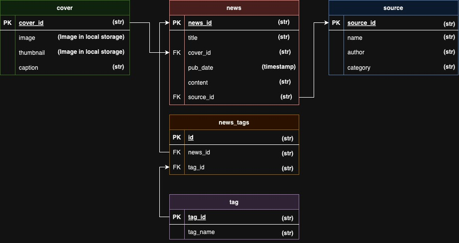
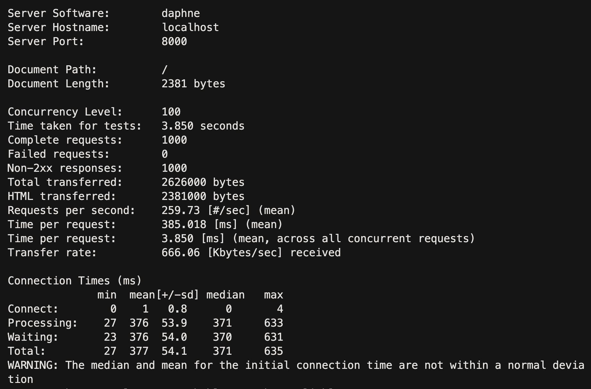

# Unnotech Backend Engineer 徵才小專案

1. - [X] 抓取 http://tw-nba.udn.com/nba/index 中的焦點新聞。
2. - [X] 使用 [Django](https://www.djangoproject.com/) 設計恰當的 Model，並將所抓取新聞存儲至 DB。
3. - [X] 使用 [Django REST Framework](http://www.django-rest-framework.org/) 配合 AJAX 實現以下頁面：
	 * 焦點新聞列表
	 * 新聞詳情頁面
4. - [X] 以 Pull-Request 的方式將代碼提交。
	
## 進階要求
1. - [X] 實現爬蟲自動定時抓取。
2. - [ ] 使用 Websocket 服務，抓取到新的新聞時立即通知前端頁面。
3. - [ ] 將本 demo 部署到伺服器並可正確運行。
4. [?] 所實現新聞列表 API 可承受 100 QPS 的壓力測試。

* 資料庫設計
	
* QPS test
	
	但是我是跑在localhost的測試，感覺好像不是這樣測試

* 後端有用docker-compose但前端沒有用